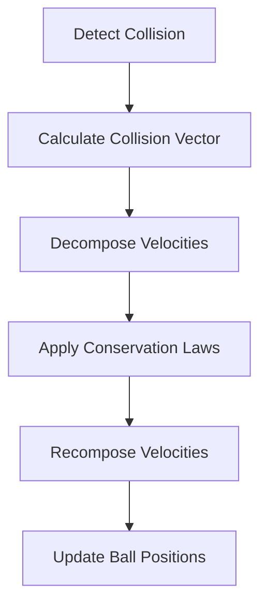

```mermaid
graph TD
    A[Detect Collision] --> B[Calculate Collision Vector]
    B --> C[Decompose Velocities]
    C --> D[Apply Conservation Laws]
    D --> E[Recompose Velocities]
    E --> F[Update Ball Positions]
```

